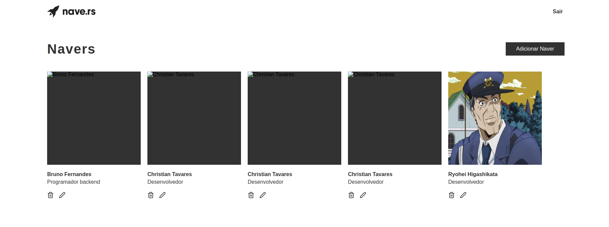
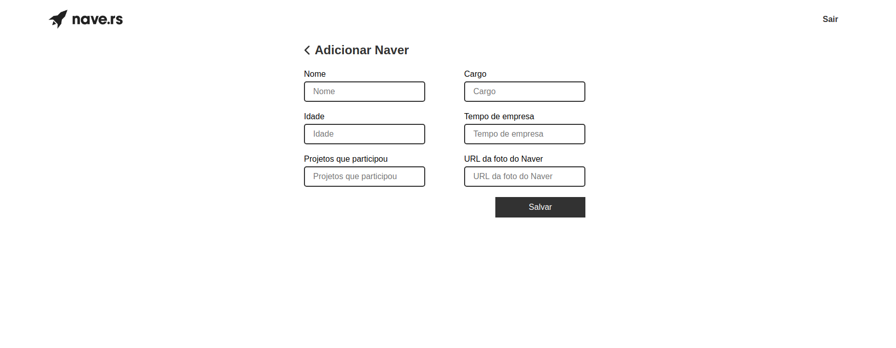
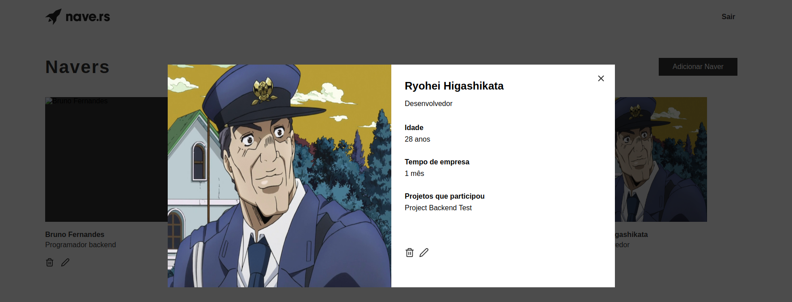
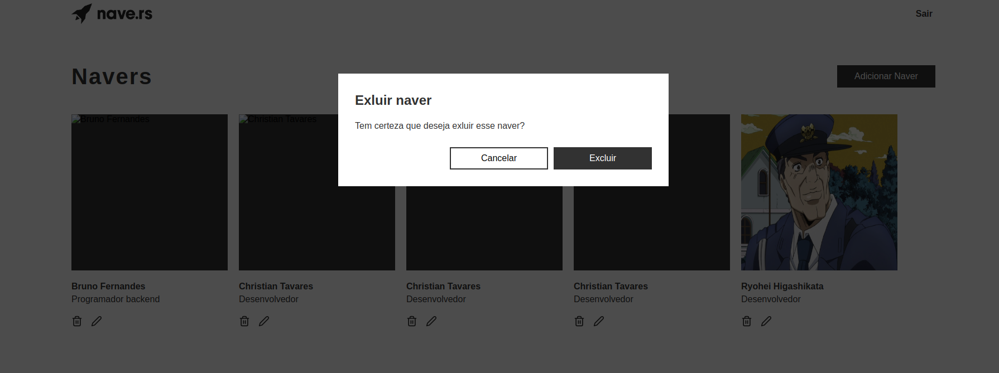
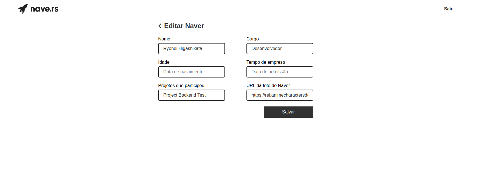

<div align="center">


</div>

<h1 align="center">Nave Frontend Challenge</h1>

<h3 align="center">Create, Read, Update and Delete Navers</h3>

<br />

<div align="center">


</div>

<p align="center">
 <a href="#star-screens">Screens</a> •
 <a href="#gear-technologies">Technologies</a> •
 <a href="#information_source-how-to-use">How to use</a> •
 <a href="#hand-author">Author</a>
</p>

---

## :star: Screens

<div align="center">








</div>

## :gear: Technologies

- React
- TypeScript
- React Router Dom
- ContextAPI
- Styled Components
- Unform
- React Icons

## :information_source: How to use

To clone and run this application, you'll need Git, Node.js v10.16 or higher + Yarn v1.13 or higher installed on your computer. From your command line:

```bash
  ## Clone this repository
  $ git clone https://github.com/Bruno-hub19/nave-frontend-challenge.git

  ## Go into the repository
  $ cd nave-frontend-challenge

  ## Install dependencies
  $ yarn install

  ## Run the metro bundler
  $ yarn start

```

## :hand: Author

<strong>Made with :heart: by Bruno Nascimento.</strong>

Connect with me on [LinkedIn](https://www.linkedin.com/in/bruno-nascimento-35803217b/)!
